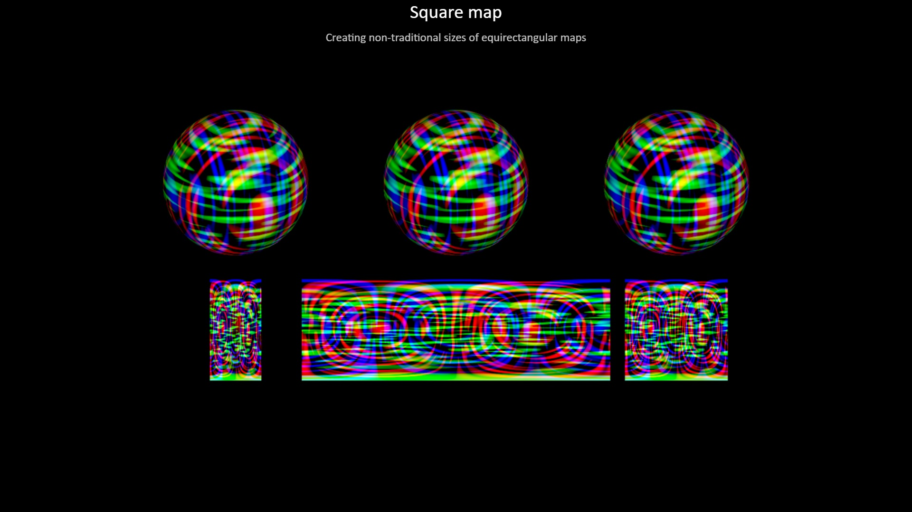

# Texture generator

This project aims at providing procedural generation of
equirectangular textures.

Go to [Project Site](https://boytchev.github.io/texture-generator/)

## A few demos

For the time being, click on a snapshot to run it live.

[<kbd style="margin:10px">Preliminary demo  </kbd>](https://boytchev.github.io/texture-generator/examples/proof-of-concept.html) [<kbd style="margin:10px">Equirectangular bump map  </kbd>](https://boytchev.github.io/texture-generator/examples/bump-map.html) [<kbd style="margin:10px">Custom map  </kbd>](https://boytchev.github.io/texture-generator/examples/custom-map.html) [<kbd style="margin:10px">AO map  </kbd>](https://boytchev.github.io/texture-generator/examples/ao-map.html)

[<kbd style="margin:5px"></kbd>](https://boytchev.github.io/texture-generator/examples/project-goals.html)
[<kbd style="margin:5px"></kbd>](https://boytchev.github.io/texture-generator/examples/square-map.html)
[<kbd style="margin:5px"></kbd>](https://boytchev.github.io/texture-generator/examples/deferred-generation.html)
