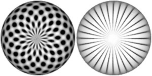
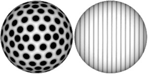
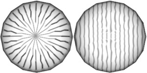
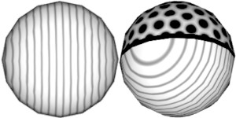



# Procedural Equirectangular Textures

## What is it?

There are many types of textures depending on the way they are
constructed, how they are used or what objects they are designed
to be applied onto. This project combines two of them:

* **Procedural textures** are generated by code,	instead
of being extracted from photographs, scanned from illustrations
or drawn by hand.

* **Equirectangular textures** are distorted in such a way,
that they can be applied onto spheres.

Consider a texture with polka dots and straight lines. The left
image shows such texture, which is perfect for flat surfaces.
An equirectangular version is shown on the right &ndash; it
features strange deformations of shapes.

	Normal texture 
	Equirectangular texture 

	
When mapped to a sphere, the normal alignment of texture shapes
gets distorted near the poles, while the equirectangular texture
creates good proportions of shapes and straight lines. The
deformation of shapes has been undeformed by the curvature of
the sphere surface. This is what this project does &ndash; it
generates equirectangular textures.

	Normal texture on sphere 
	Equirectangular texture on sphere 

	

## But wait, there is more

When textures are applied to low-poly spheres there is a noticeable
zig-zag distortion of the texture shapes, especially near the
poles. This happens for normal and equirectangular textures
alike. This phenomena is not caused by the texture itself, but
by the algorithm that maps the texture on a sphere. This project
provides a fix for this by modifying the shader code of materials.
Even after the fix, one could see sharp corners in the lines.
These are just optical illusions, caused by the hard edges of
a low-poly geometry.

	Low-poly texture distortion 
	Low-poly shader fix 

	

As the number of faces decreases, the deformation of textures
becomes disturbing. The following image shows the normal, the
equirectangular and the fixed equirectangular textures on a
dodecahedron.

	Extreme low-poly distortion fixed
by shader 

## What's the catch

Fixing the shader code of Three.js materials adds additional
instructions as a patch. A better solution would be if
equirectangular mapping is supported natively for all maps,
not just the environment map.

Unfortunately, there is another, bigger issue. Equirectangular
maps are not compatible with [mipmaps](https://en.wikipedia.org/wiki/Mipmap).
If mipmaps are used, the result will have a thin pixel-wide
seam along the edge of the texture. Currently the project
avoids the seam by turning off mipmaps. As a side effect,
this removes texture smoothing and makes texture noise more
prominent.

A possible solution might be to limit the mipmaps to only the
first few levels, or to mask the seam with sufficiently
picturesque texture. If anyone knows a performant way to resolve
this issue, it will make the library more useful to the general
community.
		

	<a href="../index.html">Home</a>

