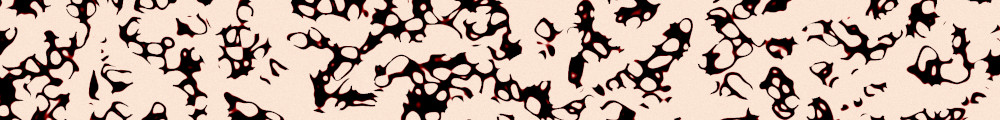
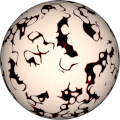
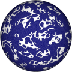
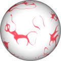

# Procedural Equirectangular Textures


## Cave art


This texture recreates a pattern that resembles
[Paleolithic cave art](https://en.wikipedia.org/wiki/Cave_painting).
With some level of imagination and [pareidolia](https://en.wikipedia.org/wiki/Pareidolia)
it is possible to see animals, peoples and even extraterrestrials. 
Click on a snapshot to open it online.

<p class="gallery">

	<a class="style-block nocaption" href="../online/cave-art.html?width=1024&height=512&scale=62&thickness=20&noise=30&color=13845829&background=16775408">
		
	</a>

	<a class="style-block nocaption" href="../online/cave-art.html?width=1024&height=512&scale=57&thickness=11&noise=78&color=16777215&background=196776">
		
	</a>

	<a class="style-block nocaption" href="../online/cave-art.html?width=1024&height=512&scale=77&thickness=2&noise=0&color=16711769&background=16777215">
		
	</a>

</p>


### Code example

Code template of parameters with their default values.

```js
import * as PET from "pet/patterns/cave-art.js";
:
model.material.map = PET.texture( );
PET.material( model.material );
```


### Parameters

The parameters of the texture generator are:

* `width` &ndash; texture width in pixels, default 1024
* `height` &ndash; texture height in pixels, default 512
* `scale` &ndash; relative paiting size [0,100], default 50
* `thickness` &ndash; thickness of shapes [0,100], default 20
* `noise` &ndash; additional noise to the background [0,100], default 30
* `color` &ndash; color of paintings, default 0xD34545 (reddish)
* `background` &ndash; color of background, default 0xFFF8F0 (pale rock)


### API

All texture modules share the same API.

* `pattern( x, y, z, color, options )` &ndash; pattern implementation
* `texture( {params} )` &ndash; generator for a texture with given parameters
* `defaults` &ndash; object with default parameters
* `material( ... )` &ndash; material shader patcher


### Online generator

[online/cave-art.html](../online/cave-art.html)


### Source

[src/patterns/cave-art.js](https://github.com/boytchev/texture-generator/blob/main/src/patterns/cave-art.js)


		
<div class="footnote">
	<a href="#" onclick="window.history.back(); return false;">Back</a>
</div>