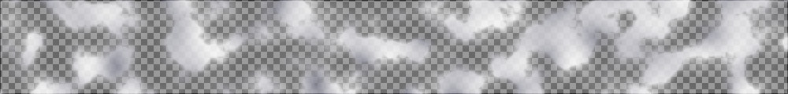
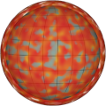
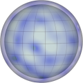

# Procedural Equirectangular Textures


## Clouds


This texture renders clouds. The texture has alpha channel
to support transparency and opacity. Click on a snapshot to
open it online.

<p class="gallery">

	<a class="style-block nocaption" href="../online/clouds.html?width=512&height=256&scale=43&density=54&opacity=79&color=16777215&subcolor=10526896">
		
	</a>

	<a class="style-block nocaption" href="../online/clouds.html?width=512&height=256&scale=11&density=63&opacity=71&color=16062464&subcolor=16771584">
		
	</a>

	<a class="style-block nocaption" href="../online/clouds.html?width=512&height=256&scale=47&density=81&opacity=55&color=16777215&subcolor=1966335">
		
	</a>

</p>


### Code example

Code template of parameters with their default values.

```js
import * as PET from "pet/patterns/clouds.js";
:
model.material.map = PET.texture( );
PET.material( model.material );
```


### Parameters

The parameters of the texture generator are:

* `width` &ndash; texture width in pixels, default 512
* `height` &ndash; texture height in pixels, default 256
* `scale` &ndash; relative could size [0,100], default 50
* `density` &ndash; density of clouds [0,100], default 50
* `opacity` &ndash; opacity of clouds [0,100], default 80
* `color` &ndash; color of dots, default 0xFFFFFF (white)
* `subcolor` &ndash; secondary color, default 0xA0A0B0 (pale gray)


### API

All texture modules share the same API.

* `pattern( x, y, z, color, options )` &ndash; pattern implementation
* `texture( {params} )` &ndash; generator for a texture with given parameters
* `defaults` &ndash; object with default parameters
* `material( ... )` &ndash; material shader patcher


### Online generator

[online/clouds.html](../online/clouds.html)


### Source

[src/patterns/clouds.js](https://github.com/boytchev/texture-generator/blob/main/src/patterns/clouds.js)


		
<div class="footnote">
	<a href="#" onclick="window.history.back(); return false;">Back</a>
</div>