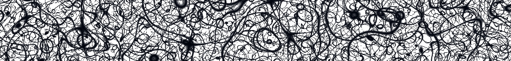
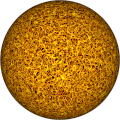

# Procedural Equirectangular Textures


## Entangled


This texture renderes a ball of entangled lines or the
[lineae of Europa](https://en.wikipedia.org/wiki/Europa_(moon)#Lineae),
one of the Galilean moons of Jupiter. The generated
texture is intended for color maps. Click on a snapshot to
open it online.

<p class="gallery">

	<a class="style-block nocaption" href="../online/entangled.html?width=1024&height=512&scale=80&density=10&color=21155&background=16777215">
		
	</a>

	<a class="style-block nocaption" href="../online/entangled.html?width=2048&height=1024&scale=86&density=6&color=16777215&background=1626389">
		
	</a>

	<a class="style-block nocaption" href="../online/entangled.html?width=2048&height=1024&scale=22&density=6&color=16775485&background=15410212">
		
	</a>

</p>


### Code example

Code template of parameters with their default values.

```js
import * as PET from "pet/patterns/entangled.js";
:
model.material.map = PET.texture( );
PET.material( model.material );
```


### Parameters

The parameters of the texture generator are:

* `width` &ndash; texture width in pixels, default 1024
* `height` &ndash; texture height in pixels, default 512
* `scale` &ndash; pattern size [0,100], default 50
* `density` &ndash; density of lines [0,20], default 10
* `color` &ndash; color of lines, default 0xFFFFFF (white)
* `background &ndash; color of background, default 0x000000 (black)


### API

All texture modules share the same API.

* `pattern( x, y, z, color, options )` &ndash; pattern implementation
* `texture( {params} )` &ndash; generator for a texture with given parameters
* `defaults` &ndash; object with default parameters
* `material( ... )` &ndash; material shader patcher


### Online generator

[online/entangled.html](../online/entangled.html)


### Source

[src/patterns/entangled.js](https://github.com/boytchev/texture-generator/blob/main/src/patterns/entangled.js)


		
<div class="footnote">
	<a href="#" onclick="window.history.back(); return false;">Back</a>
</div>