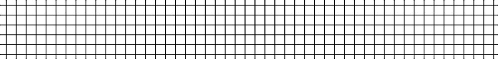
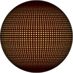
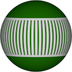

# Procedural Equirectangular Textures


## Grid


This texture draws a grid trying to maintain fixed width of
grid lines. Click on a snapshot to open it online.

<p class="gallery">

	<a class="style-block nocaption" href="../online/grid.html?countH=32&countV=16&thickness=32&caps=true&width=1024&height=512&color=0&background=16777215">
		
	</a>

	<a class="style-block nocaption" href="../online/grid.html?countH=98&countV=55&thickness=55&caps=true&width=1024&height=512&color=8716288&background=16773565">
		
	</a>

	<a class="style-block nocaption" href="../online/grid.html?countH=60&countV=3&thickness=70&caps=false&width=1024&height=512&color=15790320&background=6073865">
		
	</a>

</p>


### Code example

Code template of parameters with their default values.

```js
import * as PET from "pet/patterns/grid.js";
:
model.material.map = PET.texture( );
PET.material( model.material );
```


### Parameters

The parameters of the texture generator are:

* `width` &ndash; texture width in pixels, default 512
* `height` &ndash; texture height in pixels, default 256
* `countH` &ndash; number of horizontal grid cells [2,100], default 32
* `countV` &ndash; number of vertical grid cells [2,100], default 16
* `thickness` &ndash; thickness of grid lines [1,100], default 32
* `caps` &ndash; whether to draw caps near the poles [true,false], default true
* `color` &ndash; color of lines, default 0x000000 (black)
* `background` &ndash; color of background, default 0xFFFFFF (white)


### API

All texture modules share the same API.

* `pattern( x, y, z, color, options, u, v )` &ndash; pattern implementation
* `texture( {params} )` &ndash; generator for a texture with given parameters
* `defaults` &ndash; object with default parameters
* `material( ... )` &ndash; material shader patcher


### Online generator

[online/grid.html](../online/grid.html)


### Source

[src/patterns/grid.js](https://github.com/boytchev/texture-generator/blob/main/src/patterns/grid.js)


		
<div class="footnote">
	<a href="#" onclick="window.history.back(); return false;">Back</a>
</div>