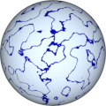

# Procedural Equirectangular Textures


## Marble


This texture renderes marble surface with threads in it.
The generated texture is intended for color maps. Click on
a snapshot to open it online.

<p class="gallery">

	<a class="style-block nocaption" href="../online/marble.html?width=1024&height=512&scale=50&thickness=60&noise=30&color=4539859&background=15792383">
		
	</a>

	<a class="style-block nocaption" href="../online/marble.html?width=2048&height=1024&scale=18&thickness=64&noise=0&color=16777215&background=0">
		
	</a>

	<a class="style-block nocaption" href="../online/marble.html?">
		
	</a>

</p>


### Code example

Code template of parameters with their default values.

```js
import * as PET from "pet/patterns/marble.js";
:
model.material.map = PET.texture( );
PET.material( model.material );
```


### Parameters

The parameters of the texture generator are:

* `width` &ndash; texture width in pixels, default 1024
* `height` &ndash; texture height in pixels, default 512
* `scale` &ndash; pattern size [0,100], default 50
* `thickness` &ndash; thickness of threads [0,100], default 60
* `nose` &ndash; noise of background [0,100], default 30
* `color` &ndash; color of lines, default 0x4545D3 (blue)
* `background &ndash; color of background, default 0xF0F8FF (light blue)


### API

All texture modules share the same API.

* `pattern( x, y, z, color, options )` &ndash; pattern implementation
* `texture( {params} )` &ndash; generator for a texture with given parameters
* `defaults` &ndash; object with default parameters
* `material( ... )` &ndash; material shader patcher


### Online generator

[online/marble.html](../online/marble.html)


### Source

[src/patterns/marble.js](https://github.com/boytchev/texture-generator/blob/main/src/patterns/marble.js)


		
<div class="footnote">
	<a href="#" onclick="window.history.back(); return false;">Back</a>
</div>