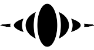
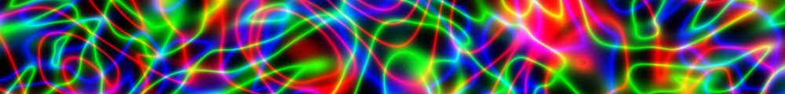
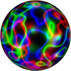
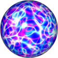
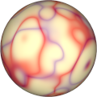

# Procedural Equirectangular Textures


## Neon lights


This texture generates plasma-like neon ligts. It overlaps
up to three neon colors. The generated texture is intended
for color maps. Click on a snapshot to open it online.

<p class="gallery">

	<a class="style-block nocaption" href="../online/neon-lights.html?width=1024&height=512&scale=50&mode=0&colorA=16711680&colorB=65280&colorC=255&background=0">
		
	</a>

	<a class="style-block nocaption" href="../online/neon-lights.html?width=1024&height=512&scale=24&mode=0&colorA=16711680&colorB=15662848&colorC=54783&background=1966335">
		
	</a>

	<a class="style-block nocaption" href="../online/neon-lights.html?width=1024&height=512&scale=54&mode=1&colorA=1162151&colorB=8689695&colorC=0&background=16775904">
		
	</a>

</p>


### Code template

Code template of parameters with their default values.

```js
import * as PET from "pet/patterns/neon-lights.js";
:
model.material.map = PET.texture( );
PET.material( model.material );
```


### Parameters

The parameters of the texture generator are:

* `width` &ndash; texture width in pixels, default 512
* `height` &ndash; texture height in pixels, default 256
* `scale` &ndash; pattern size [0,100], default 50
* `mode` &ndash; additive or subtractive blending, default additive
* `colorA` &ndash; first neon color, default 0xFF0000 (red)
* `colorB` &ndash; second neon color, default 0x00FF00 (green)
* `colorC` &ndash; third neon color, default 0x0000FF (blue)
* `background` &ndash; background color, default 0x000000 (black)

In additive mode:
* neon colors are added to the background color
* background color is supposed to be dark
* a neon color is turned off when it is black

In subtractive mode:
* neon colors are subtracted from the background color
* background color is supposed to be light
* a neon color is turned off when it is white


### API

All texture modules share the same API.

* `pattern( x, y, z, color, options )` &ndash; pattern implementation
* `texture( {params} )` &ndash; generator for a texture with given parameters
* `defaults` &ndash; object with default parameters
* `material( ... )` &ndash; material shader patcher


### Online generator

[online/neon-lights.html](../online/neon-lights.html)

### Source

[src/patterns/neon-lights.js](https://github.com/boytchev/texture-generator/blob/main/src/patterns/neon-lights.js)


		
<div class="footnote">
	<a href="#" onclick="window.history.back(); return false;">Back</a>
</div>