# Predefined patterns

* [Camouflage](#camouflage) &ndash; 4-color spots of camouflage design
* [Concrete](#concrete) &ndash; grainy surface of concrete
* [Isolines](#isolines) &ndash; looped concentric curves
* [Polka dots](#polka-dots) &ndash; fashion design with dots
* [Simplex noise](#simplex-noise) &ndash; gradient noise pattern
* [Stars](#stars) &ndash; night sky stars
* [Zebra lines](#zebra-lines) &ndash; alternating white and black stripes


Each predefined pattern is implemented as JS module file, exporting the same set of functions:
* **`pattern`** &ndash; the pattern function
* **`options`** &ndash; converter from user-defined options to internal pettern-specific options
* **`share`** &ndash; converter from user-defined options to shareable URL with options parameters
* **`info`** &ndash; general info about the pattern, like name, description and so on

The values of all colors are integers &#x2208; [0,16777215] (i.e. [0x000000,0xFFFFFF]).


# Camouflage
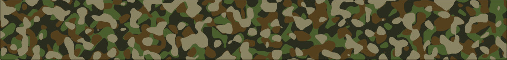

[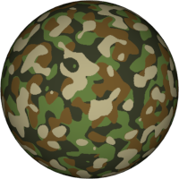](https://boytchev.github.io/texture-generator/online/camouflage.html?a=12762792&b=10258782&c=9610101&d=7435617&g=0&h=0&r=9&s=50&t=0) [](https://boytchev.github.io/texture-generator/online/camouflage.html?a=12762792&b=10258782&c=9610101&d=7435617&g=22&h=194&r=9&s=73&t=4)  [](https://boytchev.github.io/texture-generator/online/camouflage.html?a=16776960&b=0&c=16187392&d=5234974&g=-18&h=0&r=9&s=11&t=-2) 

#### Options:

* `colorA` (`a`) &ndash; integer; the top-most camouflage color
* `colorB` (`b`) &ndash; integer; the secondary camouflage color
* `colorC` (`c`) &ndash; integer; the tertiary camouflage color
* `colorD` (`d`) &ndash; integer; the bottom-most camouflage color
* `resolution` (`r`) &ndash; integer; the resolution of the texture is 2<sup>r</sup>&times;2<sup>r-1</sup>
* `size` (`s`) &ndash; number; the visual size of the pattern &#x2208; [0,100]
* `hue` (`h`) &ndash; number; hue offset of all colors &#x2208; [-360&deg;,360&deg;]
* `saturation` (`t`) &ndash; number; saturation offset of all colors &#x2208; [-100%,100%]
* `brightness` (`g`) &ndash; number; brightness offset of all colors &#x2208; [-100%,100%]

#### Defaults:

```js
options = {
	colorA: 0xc2bea8,
	colorB: 0x9c895e,
	colorC: 0x92a375,
	colorD: 0x717561,
	resolution: 9, // 512x256
	size: 50,
	hue: 0,
	saturation: 0,
	brightness: 0,
}
```


# Concrete
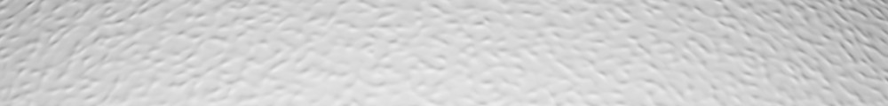

[](https://boytchev.github.io/texture-generator/online/concrete?h=100&r=9&s=50) [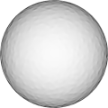](https://boytchev.github.io/texture-generator/online/concrete?h=100&r=9&s=78) 

#### Options:

* `resolution` (`r`) &ndash; integer; the resolution of the texture is 2<sup>r</sup>&times;2<sup>r-1</sup>
* `size` (`s`) &ndash; number; the visual size of the pattern &#x2208; [0,100]
* `height` (`h`) &ndash; number; concrete bumps height &#x2208; [0%,100%]

#### Defaults:

```js
options = {
	resolution: 9, // 512x256
	size: 50,
	height: 100,
}
```


# Isolines
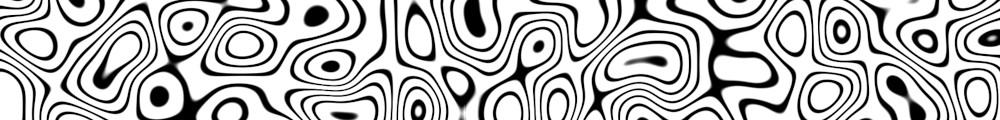

[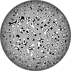](https://boytchev.github.io/texture-generator/online/isolines?a=50&b=10&d=20&c=16777215&k=0&r=9&s=50) [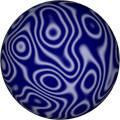](https://boytchev.github.io/texture-generator/online/isolines?a=11&b=65&d=20&c=16777215&k=1443&r=9&s=81)  [](https://boytchev.github.io/texture-generator/online/isolines?a=22&b=0&d=15&c=13574176&k=16777215&r=9&s=100) 

#### Options:

* `color` (`c`) &ndash; integer; the color of isolines
* `backgroundColorB` (`k`) &ndash; integer; the color of background
* `resolution` (`r`) &ndash; integer; the resolution of the texture is 2<sup>r</sup>&times;2<sup>r-1</sup>
* `size` (`s`) &ndash; number; the visual size of the pattern &#x2208; [0,100]
* `density` (`d`) &ndash; number; density of isolines &#x2208; [0,100]
* `blur` (`b`) &ndash; number; blur factor of isoline edges &#x2208; [0,100]
* `balance` (`a`) &ndash; number; balance of isoline thickness and gaps &#x2208; [0,100]

#### Defaults:

```js
options = {
	color: 0xffffff,
	backgroundColor: 0x000000,
	resolution: 9, // 512x256
	size: 50,
	density: 20,
	blur: 10,
	balance: 50,
}
```


# Polka dots
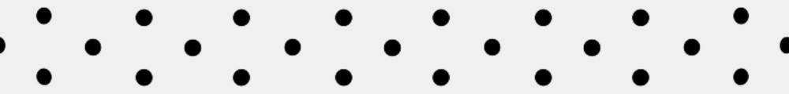

[](https://boytchev.github.io/texture-generator/online/polka-dots?a=9&b=20&c=0&k=16777215&r=9&s=30) [](https://boytchev.github.io/texture-generator/online/polka-dots?a=3&b=20&c=15461355&k=53507&r=9&s=65)  [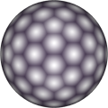](https://boytchev.github.io/texture-generator/online/polka-dots?a=8&b=82&c=15263976&k=5187937&r=9&s=39) 

#### Options:

* `arrangement` (`a`) &ndash; integer; the id of the dots arrangement &#x2208; [0,11]
* `color` (`c`) &ndash; integer; the color of dots
* `backgroundColorB` (`k`) &ndash; integer; the color of background
* `resolution` (`r`) &ndash; integer; the resolution of the texture is 2<sup>r</sup>&times;2<sup>r-1</sup>
* `size` (`s`) &ndash; number; the visual size of the pattern &#x2208; [0,100]
* `blur` (`b`) &ndash; number; blur factor of dots edges &#x2208; [0,100]

#### Defaults:

```js
options = {
	arrangement: 7,
	color: 0x000000,
	backgroundColor: 0xffffff,
	resolution: 9, // 512x256
	size: 30,
	blur: 20,
}
```


# Simplex noise
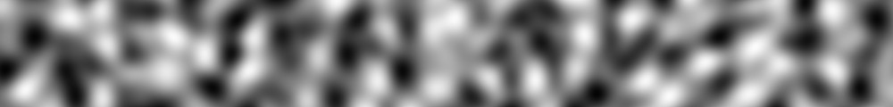

[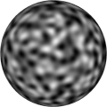](https://boytchev.github.io/texture-generator/online/simplex-noise?b=50&c=16777215&k=0&r=9&s=52) [](https://boytchev.github.io/texture-generator/online/simplex-noise?b=78&c=16766208&k=0&r=9&s=57)  [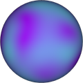](https://boytchev.github.io/texture-generator/online/simplex-noise?b=44&c=13893887&k=11592439&r=9&s=86) 

#### Options:

* `color` (`c`) &ndash; integer; the color of simplex-noise
* `backgroundColor` (`k`) &ndash; integer; the color of background
* `resolution` (`r`) &ndash; integer; the resolution of the texture is 2<sup>r</sup>&times;2<sup>r-1</sup>
* `size` (`s`) &ndash; number; the visual size of the pattern &#x2208; [0,100]
* `balance` (`a`) &ndash; number; balance of foreground and background colors &#x2208; [0,100]

#### Defaults:

```js
options = {
	color: 0xffffff,
	backgroundColor: 0x000000,
	resolution: 9, // 512x256
	size: 30,
	balance: 50,
}
```


# Stars
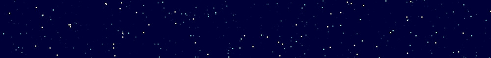

[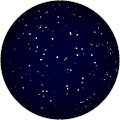](https://boytchev.github.io/texture-generator/online/stars?b=50&c=16774640&d=30&k=96&r=9&v=0) [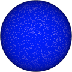](https://boytchev.github.io/texture-generator/online/stars?b=100&c=16774640&d=100&k=25343&r=9&v=0)  [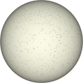](https://boytchev.github.io/texture-generator/online/stars?b=100&c=16733440&d=84&k=16777205&r=9&v=100) 

#### Options:

* `color` (`c`) &ndash; integer; the color of stars
* `backgroundColor` (`k`) &ndash; integer; the color of the sky
* `resolution` (`r`) &ndash; integer; the resolution of the texture is 2<sup>r</sup>&times;2<sup>r-1</sup>
* `density` (`d`) &ndash; number; the density (amount) of stars &#x2208; [0,100]
* `brightness` (`b`) &ndash; number; the brightness of stars &#x2208; [0,100]
* `variation` (`v`) &ndash; number; hue variation of stars color &#x2208; [0,100]

#### Defaults:

```js
options = {
	starsColor: 0xfff5f0,
	skyColor: 0x000060,
	resolution: 9,
	density: 30,
	brightness: 50,
	variation: 0,
}
```


# Zebra lines
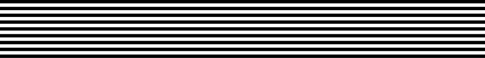

[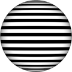](https://boytchev.github.io/texture-generator/online/zebra-lines?a=0&r=9&s=80) [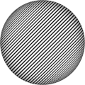](https://boytchev.github.io/texture-generator/online/zebra-lines?a=45&r=9&s=30)  [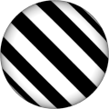](https://boytchev.github.io/texture-generator/online/zebra-lines?a=-45&r=9&s=94) 

#### Options:

* `resolution` (`r`) &ndash; integer; the resolution of the texture is 2<sup>r</sup>&times;2<sup>r-1</sup>
* `size` (`s`) &ndash; number; the visual size of the pattern &#x2208; [0,100]
* `angle` (`a`) &ndash; number; the angle of pattern tilt &#x2208; [-180&deg;,180&deg;]

#### Defaults:

```js
options = {
	resolution: 9, // 512x256
	size: 50,
	angle: 0,
}


