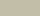
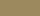
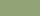
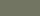

# Predefined patterns

Each predefined pattern is implemented as JS module file, exporting the same set of functions:
* **`pattern`** &ndash; the pattern function
* **`options`** &ndash; converter from user-defined options to internal pettern-specific options
* **`share`** &ndash; converter from user-defined options to shareable URL with options parameters
* **`info`** &ndash; general info about the pattern, like name, description and so on

The values of all colors are integers &#x2208; [0,16777215] (i.e. [0x000000),0xFFFFFF]).


# `camouflage.js`

A pattern of 4-color spots that resembles designs of camouflage. Suitable for color maps.

* `colorA` (`a`) &ndash; integer; the top-most camouflage color, default value 12762792 (0xC2BEA8), 
* `colorB` (`b`) &ndash; integer; the secondary camouflage color, default value 10258782 (0x9C895E), 
* `colorC` (`c`) &ndash; integer; the tertiary camouflage color, default value 9610101 (0x92A375), 
* `colorD` (`d`) &ndash; integer; the bottom-most camouflage color, default value 7435617 (0x717561), 
* `resolution` (`r`) &ndash; integer; the resolution of the texture is 2<sup>r</sup>&times;2<sup>r-1</sup>, default value 9, i.e. 512x256
* `size` (`s`) &ndash; number; the visual size of the pattern &#x2208; [0,100], default value 50
* `hue` (`h`) &ndash; number; hue offset of all colors &#x2208; [-360&deg;,360&deg;], default value 0&deg;
* `saturation` (`t`) &ndash; number; saturation offset of all colors &#x2208; [-100%,100%], default value 0%
* `brightness` (`g`) &ndash; number; brightness offset of all colors &#x2208; [-100%,100%], default value 0%

Examples:


# `generator.js`

Module. Implements the equirectangular texture generator and provides the result
as a texture or as a canvas. The pattern of the texture is a callback function.

## equitexture

Function. Generates an equirectangular texture. Returns it a
[THREE.CanvasTexture](https://threejs.org/docs/#api/en/textures/CanvasTexture)
object with turned off mipmaps. All parameters are optional and can be passed in
any order, except for width and height.

```js
equitexture( pattern )
equitexture( pattern, width )
equitexture( pattern, width, height )
equitexture( pattern, width, height, canvas )
equitexture( pattern, width, height, canvas, deferred )
equitexture( pattern, width, height, canvas, deferred, options )
```

where:

* `pattern` &ndash; optional user-defined [callback function](#pattern-function)
that calculates the pattern of the texture at a point in 3D space. If not provided,
a [default dotted pattern](../examples/default-pattern.html) is used.

* `width` &ndash; optional integer number for the texture width in pixels. If
not provided, the canvas width is used. If the canvas is also not provided, a
default value 1024 is used.

* `height` &ndash; optional integer number for the texture height in pixels.
If not provided, the height is automatically set to half width. If the width is
not provided, the canvas height is used. If the canvas is also not provided, a
default value 512 is used.

* `canvas` &ndash; optional [HTML canvas]([HTMLCanvasElement](https://developer.mozilla.org/en-US/docs/Web/API/HTMLCanvasElement))
element to use for rendering. If not provided, a new hidden canvas is created.

* `deferred` &ndash; optional boolean. If it is `true` the texture generation
is deferred and the function returns immediately. If not provided, the whole
texture is generated. Deferred textures are generated by their update method.
See [deferred textures](#deferred-textures) for more details.

* `options` &ndash; optional object. Elements of options are used to customize
the pattern function (e.g. the color to use, the size of the shapes, etc.) The
content of *options* is specific to each pattern function.


	
## equicanvas

Function. Generates a canvas with an equirectangular texture. Returns it as an
[HTMLCanvasElement](https://developer.mozilla.org/en-US/docs/Web/API/HTMLCanvasElement)
object. All parameters are optional and can be passed in any order, except for width and height.

```js
equicanvas( pattern )
equicanvas( pattern, width )
equicanvas( pattern, width, height )
equicanvas( pattern, width, height, canvas )
equicanvas( pattern, width, height, canvas, deferred )
equicanvas( pattern, width, height, canvas, deferred, options )
```

where the parameters are the same as in [equitexture](#equitexture).


## Pattern function

Callback function. This is a user-defind function that generates a specific pattern.
The function calculates the color of a 3D point in 3D space, based on its (x,y,z)
coordinates, its texture coordinates (u,v), its pixel coordinates (px,py) and the
texture size (width,height). 

```js
pattern( x,y,z, color )
pattern( x,y,z, color, options )
pattern( x,y,z, color, options, u,v )
pattern( x,y,z, color, options, u,v, px,py )
pattern( x,y,z, color, options, u,v, px,py, width,height )
```

where:

* `x`,`y`,`z` &ndash; floats; coordiates of a point on a sphere, *x,y,z* &#x2208; [-1,1].
* `color` &ndash; [THREE.Color](https://threejs.org/docs/#api/en/math/Color); 
its properties *r,g,b* &#x2208; [0,1] must be updated by the pattern function.
An additional property *a* &#x2208; [0,1] could be set for encoding alpha transparency. 
* `options` &ndash; object; contains customization parameters of the pattern function. 
* `u`,`v` &ndash; floats; texture coordiates of a pixel on the texture, *u,v* &#x2208; [0,1].
* `px`,`py` &ndash; integers; coordiates of a pixel in the texture, *px* &#x2208; [0,width-1], *py* &#x2208; [0,height-1].
* `width`,`height` &ndash; integers; size of the texture in pixels.


## Deferred textures

A deferred texture is one that is initially created empty, and it is generated
later on. The generation of deferred textures is performed in steps, controlled
by the user. This is usually applied for large textures to prevent prolonged
blocking of user interface.

A deferred generation is set by `true` parameter of [equitexture](#equitexture)
or [equicanvas](#equicanvas). A single step of the generation is caried out by
the method `update`.

```js
texture.update( ms )
canvas.update( ms )
```

where:

* `ms` - optional number; the number of [milliseconds](https://en.wikipedia.org/wiki/Millisecond)
to spend on generating texture. If not provided, a 30 ms time span is used (i.e. 0.03 seconds).
At least one full row of pixels is generated at each update. If the texture is
completely generated, `update` does nothing. The return value is the completion
status as a number &#x2208; [0,1].

This is an [example of deferred texture](../examples/deferred-generation).


# `noise.js`

Module. Defines a seedable 3D noise function, that is used by variour texture
patterns. It is based on [THREE.SimplexNoise](https://github.com/mrdoob/three.js/blob/master/examples/jsm/math/SimplexNoise.js)
and [THREE.MathUtils.seededRandom](https://threejs.org/docs/#api/en/math/MathUtils.seededRandom).


## noise

Function. A 3D noise function. Returns a pseudo-random number &#x2208; [-1,1]
for a point in 3D space.

```js
noise( x, y, z )
```

where:

* `x` &ndash; float; x coordinate of 3D point.
* `y` &ndash; float; y coordinate of 3D point.
* `z` &ndash; float; z coordinate of 3D point.


## noiseSeed

Command. Sets the behavior of the [noise](#noise) function. If the optional
seed is an integer number, the next generated pseudo-random numbers are based on
this seed. Otherwise the current timestamp is used as a seed to achieve a kind
of randomization.

```js
noiseSeed( )
noiseSeed( seed )
```

where:

* `seed` &ndash; integer, optional; the seed vale for future pseudo-random numbers


# `material.js`

Module. Used to patch the shader of a material to reduce geometrical artifacts.


## `equimaterial`

Function. Patches the shader of a [THREE.Material](https://threejs.org/docs/#api/en/materials/Material)
descendants. This patch reduces the texture zigzagging near the poles. Returns 
the modified material. The function may not work for materials with user-provided
shaders.

```js
equimaterial( material )
```

where:

* `material` &ndash; a descendant of `THREE.Material` that must be patched. Only
`map` and `bumpMap` textures are patched; `envMap` does not need patching; and
all the rest maps are not patched (i.e. `alphaMap`, `anisotropyMap`, `aoMap`,
`clearcoatNormalMap`, `clearcoatMap`, `clearcoatRoughnessMap`, `displacementMap`,
`emissiveMap`, `gradientMap`, `iridescenceMap`, `iridescenceThicknessMap`,
`lightMap`, `matcap`, `metalnessMap`, `normalMap`, `roughnessMap`, `sheenColorMap`,
`sheenRoughnessMap`, `specularMap`, `specularColorMap`, `specularIntensityMap`,
`thicknessMap`, `transmissionMap`).
