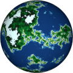
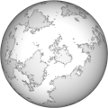
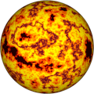

# Procedural Equirectangular Textures


## Planet


This texture generates the surface colors of a planet. There
are seven types of terrains groups into three clusters: water
(deep and shallow), land (beach, low land and high land) and
mountains (rocky and snowy parts). The generated texture is
for color maps. Click on a snapshot to open it online.

<p class="gallery">

	<a class="style-block nocaption" href="../online/planet.html?width=1024&height=512&scale=68&colorDeep=4620980&colorShallow=8900331&colorBeach=16775885&colorGrass=3978097&colorForest=3050327&colorRock=4210752&colorSnow=15794175&sizeDeep=40&sizeShallow=20&sizeBeach=5&sizeGrass=40&sizeForest=40&sizeRock=50">
		
	</a>

	<a class="style-block nocaption" href="../online/planet.html?width=1024&height=512&scale=82&colorDeep=16777215&colorShallow=16777215&colorBeach=14079702&colorGrass=15461355&colorForest=11579568&colorRock=14737632&colorSnow=15790320&sizeDeep=18&sizeShallow=20&sizeBeach=7&sizeGrass=2&sizeForest=9&sizeRock=20">
		
	</a>

	<a class="style-block nocaption" href="../online/planet.html?width=1024&height=512&scale=50&colorDeep=11814497&colorShallow=10027023&colorBeach=16751892&colorGrass=16774912&colorForest=16759552&colorRock=16728064&colorSnow=7012352&sizeDeep=7&sizeShallow=0&sizeBeach=5&sizeGrass=40&sizeForest=45&sizeRock=28">
		
	</a>

</p>


### Code template

Code template of parameters with their default values.

```js
import * as PET from "pet/patterns/planet.js";
:
model.material.map = PET.texture( );
PET.material( model.material );
```


### Parameters

The parameters of the texture generator are:

* `width` &ndash; texture width in pixels, default 512
* `height` &ndash; texture height in pixels, default 256
* `scale` &ndash; pattern size [0,100], default 50

Ocean parameters:

* `colorDeep` &ndash; color of deep ocean water, default 0x4682B4 (blue)
* `sizeDeep` &ndash; size of deep ocean water, default 40
* `colorShallow` &ndash; color of shallow coastal water, default 0x87CEEB (light blue)
* `sizeShallow` &ndash; size of shallow coatsel water, default 20

Land parameters:

* `colorBeach` &ndash; color of beach sand, default 0xFFFACD (light yellow)
* `sizeBeach` &ndash; size of beach sand, default 5
* `colorGrass` &ndash; color of low land grass, default 0x3CB371 (green)
* `sizeGrass` &ndash; size of low land grass, default 40
* `colorForest` &ndash; color of high land forest, default 0x2E8B57 (dark green)
* `sizeForest` &ndash; size of high land forest, default 40

Mountain parameters:

* `colorRock` &ndash; color of rocky part of mountains, default 0x404040 (dark gray)
* `sizeRock` &ndash; size of rocky part of mountains, default 50
* `colorSnow` &ndash; color of snowy mountains peaks, default 0xF0FFFF (almost white)


### API

All texture modules share the same API.

* `pattern( x, y, z, color, options )` &ndash; pattern implementation
* `texture( {params} )` &ndash; generator for a texture with given parameters
* `defaults` &ndash; object with default parameters
* `material( ... )` &ndash; material shader patcher


### Online generator

[online/planet.html](../online/planet.html)

### Source

[src/patterns/planet.js](https://github.com/boytchev/texture-generator/blob/main/src/patterns/planet.js)


		
<div class="footnote">
	<a href="#" onclick="window.history.back(); return false;">Back</a>
</div>