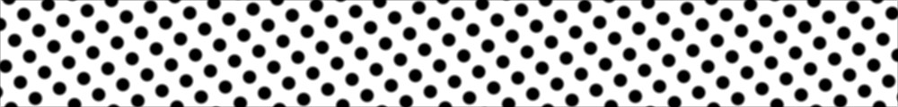

# Procedural Equirectangular Textures


## Polka dots


This texture arranges dots similar to the [Polka dots](https://en.wikipedia.org/wiki/Polka_dot)
in fashion design. There are 20 layouts for the dots ranging from a single dot,
then vertices of [Platonic soids](https://en.wikipedia.org/wiki/Platonic_solid)
derivatives and vertices of a sunflower seeds arragement (also known as Fibonacci
lattice) with up to 5000 dots. Click on a snapshot to open it online.

<p class="gallery">

	<a class="style-block nocaption" href="../online/polka-dots.html?width=1024&height=512&layout=11&scale=65&blur=20&color=0&background=16777215">
		
	</a>

	<a class="style-block nocaption" href="../online/polka-dots.html?width=1024&height=512&layout=5&scale=80&blur=20&color=16777215&background=54798">
		
	</a>

	<a class="style-block nocaption" href="../online/polka-dots.html?width=1024&height=512&layout=10&scale=80&blur=80&color=15263976&background=5187937">
		
	</a>

</p>


### Code example

Code template of parameters with their default values.

```js
import * as PET from "pet/patterns/polka-dots.js";
:
model.material.map = PET.texture( );
PET.material( model.material );
```


### Parameters

The parameters of the texture generator are:

* `width` &ndash; texture width in pixels, default 512
* `height` &ndash; texture height in pixels, default 256
* `layout` &ndash; dot layout number [1,*$layouts*], default 9
* `scale` &ndash; relative dot size [0,100], default 50
* `blur` &ndash; smoothness of dots edges [0,100], default 20
* `color` &ndash; color of dots, default 0x000000 (black)
* `background` &ndash; color of background, default 0xFFFFFF (white)

Additional system parameter:

* `$layouts` &ndash; the number of supported layouts, currently 20


### API

All texture modules share the same API.

* `pattern( x, y, z, color, options )` &ndash; pattern implementation
* `texture( {params} )` &ndash; generator for a texture with given parameters
* `defaults` &ndash; object with default parameters
* `material( ... )` &ndash; material shader patcher


### Online generator

[online/polka-dots.html](../online/polka-dots.html)


### Source

[src/patterns/polka-dots.js](https://github.com/boytchev/texture-generator/blob/main/src/patterns/polka-dots.js)


		
<div class="footnote">
	<a href="#" onclick="window.history.back(); return false;">Back</a>
</div>