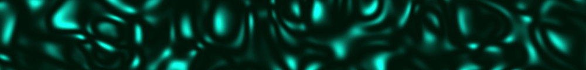
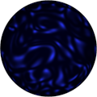
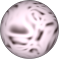
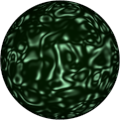

# Procedural Equirectangular Textures


## satin


This texture recreates the wrinkles of a satin cloth. The
generated texture is intended for color maps. Click on a
snapshot to open it online.

<p class="gallery">

	<a class="style-block nocaption" href="../online/satin.html?width=512&height=256&scale=50&color=7373055&background=80">
		
	</a>

	<a class="style-block nocaption" href="../online/satin.html?width=512&height=256&scale=66&color=8020578&background=16774651">
		
	</a>

	<a class="style-block nocaption" href="../online/satin.html?width=512&height=256&scale=26&color=14417894&background=1593856">
		
	</a>

</p>


### Code example

Code template of parameters with their default values.

```js
import * as PET from "pet/patterns/satin.js";
:
model.material.map = PET.texture( );
PET.material( model.material );
```


### Parameters

The parameters of the texture generator are:

* `width` &ndash; texture width in pixels, default 512
* `height` &ndash; texture height in pixels, default 256
* `scale` &ndash; pattern size [0,100], default 50
* `color` &ndash; main color of glossy parts, default 0x7080FF (light blue)
* `background &ndash; background color of dark parts, default 0x000050 (dark blue)


### API

All texture modules share the same API.

* `pattern( x, y, z, color, options )` &ndash; pattern implementation
* `texture( {params} )` &ndash; generator for a texture with given parameters
* `defaults` &ndash; object with default parameters
* `material( ... )` &ndash; material shader patcher


### Online generator

[online/satin.html](../online/satin.html)


### Source

[src/patterns/satin.js](https://github.com/boytchev/texture-generator/blob/main/src/patterns/satin.js)


		
<div class="footnote">
	<a href="#" onclick="window.history.back(); return false;">Back</a>
</div>