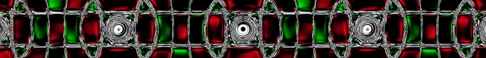
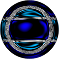
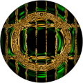
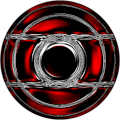

# Procedural Equirectangular Textures


## Scepter head


This texture designs the stone and the metal rim of a scepter head.
The generated texture is intended for color maps. Click on
a snapshot to open it online.

<p class="gallery">

	<a class="style-block nocaption" href="../online/scepter-head.html?width=1024&height=512&xFactor=18&yFactor=36&zFactor=0&colorRim=16777215&colorA=7397631&colorB=3145983">
		
	</a>

	<a class="style-block nocaption" href="../online/scepter-head.html?width=1024&height=512&xFactor=13&yFactor=36&zFactor=74&colorRim=16766208&colorA=1937712&colorB=327424">
		
	</a>

	<a class="style-block nocaption" href="../online/scepter-head.html?width=2048&height=1024&xFactor=0&yFactor=35&zFactor=70&colorRim=16777215&colorA=16711680&colorB=16711680">
		
	</a>

</p>


### Code template

Code template of parameters with their default values.

```js
import * as PET from "pet/patterns/scepter-head.js";
:
model.material.map = PET.texture( );
PET.material( model.material );
```


### Parameters

The parameters of the texture generator are:

* `width` &ndash; texture width in pixels, default 1024
* `height` &ndash; texture height in pixels, default 512
* `factorX` &ndash; rim design along X axis [0,100], default 18
* `factorY` &ndash; rim design along Y axis [0,100], default 36
* `factorZ` &ndash; rim design along Z axis [0,100], default 0
* `colorRim` &ndash; color of the rim, default 0xFFFFFF
* `colorA` &ndash; stone color, default 0x70E0FF (light blue)
* `colorB` &ndash; sdcendant stone color, default 0x3000FF (blue)


### API

All texture modules share the same API.

* `pattern( x, y, z, color, options )` &ndash; pattern implementation
* `texture( {params} )` &ndash; generator for a texture with given parameters
* `defaults` &ndash; object with default parameters
* `material( ... )` &ndash; material shader patcher


### Online generator

[online/scepter-head.html](../online/scepter-head.html)

### Source

[src/patterns/scepter-head.js](https://github.com/boytchev/texture-generator/blob/main/src/patterns/scepter-head.js)


		
<div class="footnote">
	<a href="#" onclick="window.history.back(); return false;">Back</a>
</div>