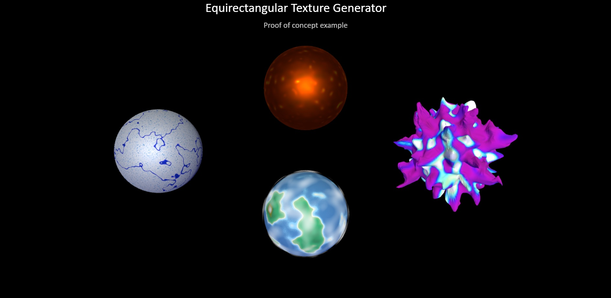
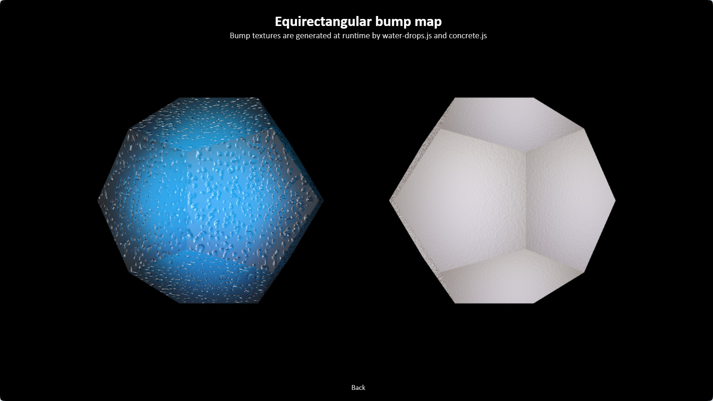
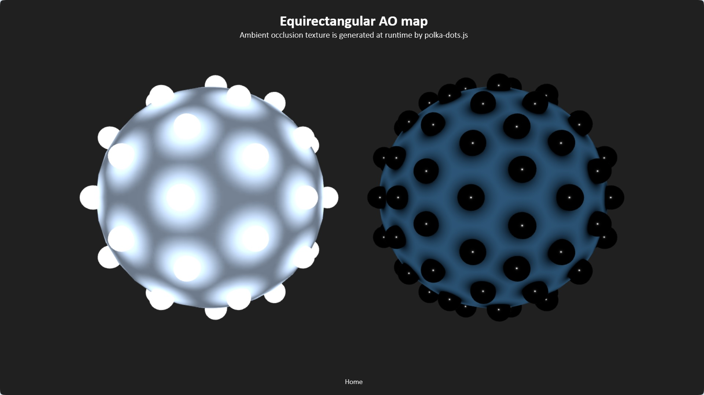
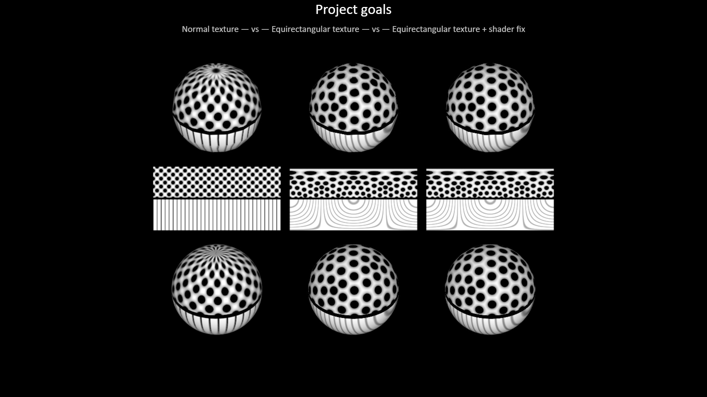
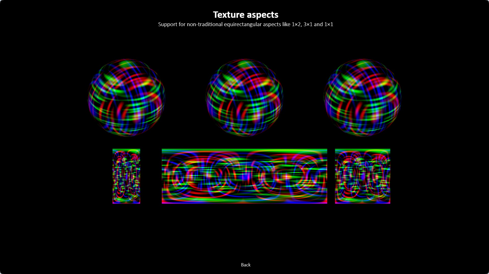

# Procedural Equirectangular Textures

## Artistic examples

Here are a few more artistic examples. They all use procedurally
generated equirectangular textures. No textures are read from
file, everything is generated at runtime.

 

		

	<a href="#" onclick="window.history.back(); return false;">Back</a>

